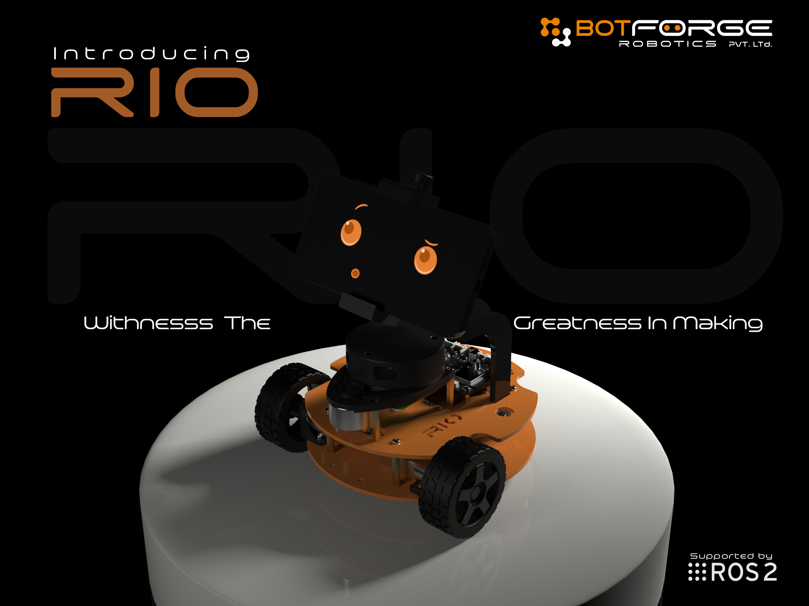
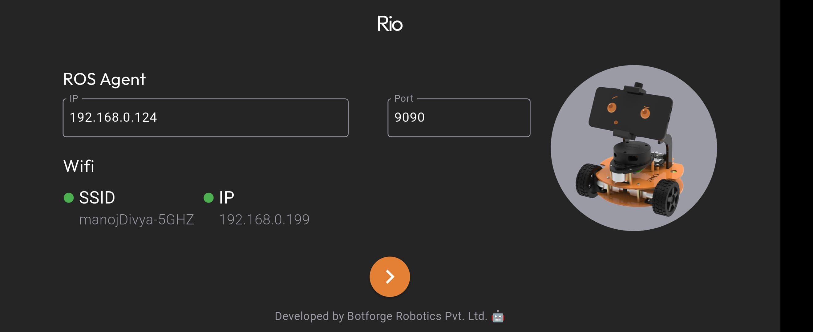
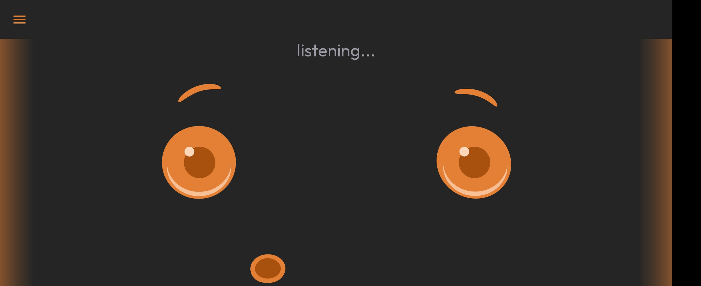
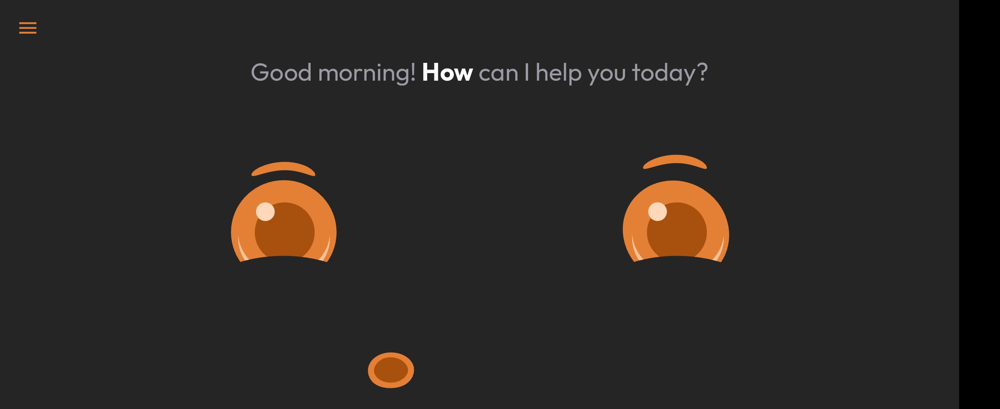
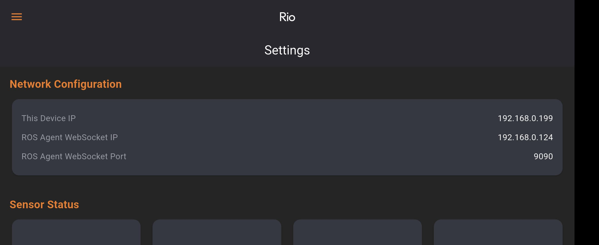
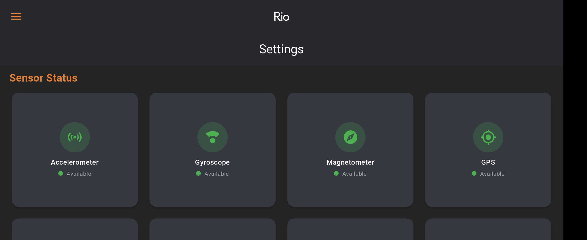
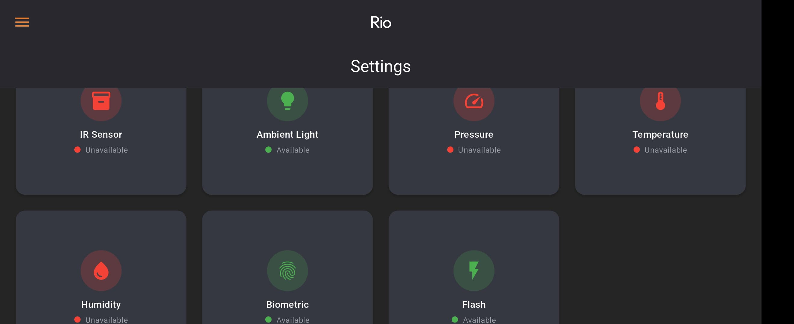
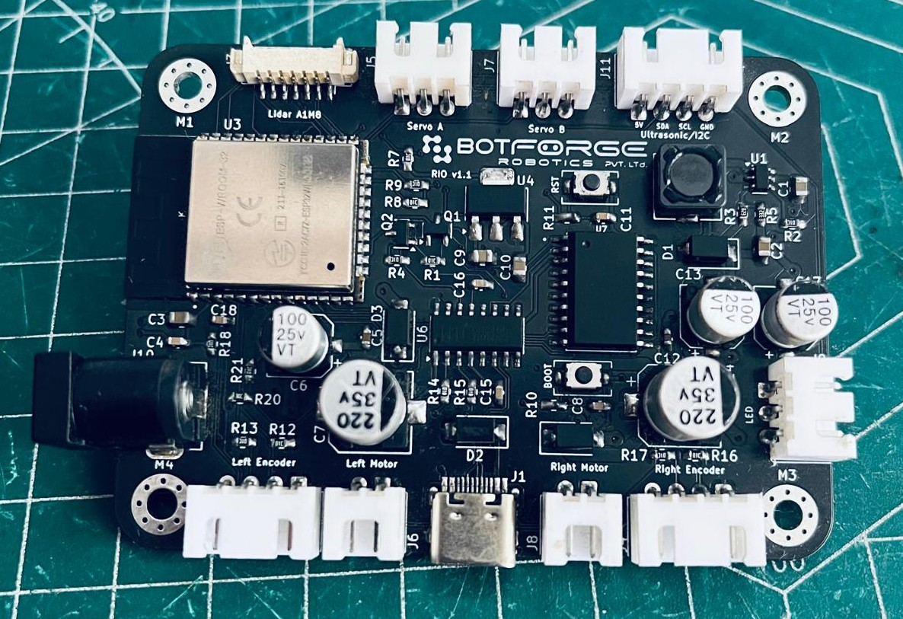
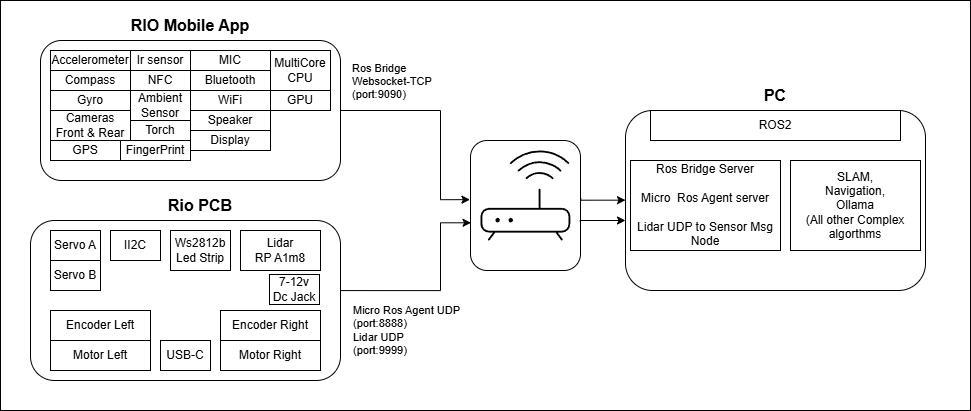

<div align="center">
    
    
    
    
    
    
    
    
    
    
</div>

<h2 align="center">Welcome to the Project RIO!</h2>



🤖 **RIO Revolution** - Transform your smartphone into a fully-featured ROS2 robot! Utilize a wide array of built-in mobile sensors, including the Accelerometer, Gyro, Compass, GPS, NFC, IR, Ambient Light, Fingerprint Scanner, Cameras, and Mic/Speaker, as ROS2 topics, services, and actions. With the integration of Lidar, we can enable autonomously navigating companion robots that express emotions through animated facial expressions, while also extending functionality with our custom hardware platform.

## 📑 Table of Contents
- [📑 Table of Contents](#-table-of-contents)
  - [📱 Mobile Core Features](#-mobile-core-features)
  - [🛠️ Hardware Expansion](#️-hardware-expansion)
- [🏛️ Rio Architecture](#️-rio-architecture)
- [⚙️ Requirements](#️-requirements)
  - [Hardware Requirements](#hardware-requirements)
  - [Software Requirements](#software-requirements)
- [🚀 Getting Started](#-getting-started)
  - [1. Environment Setup](#1-environment-setup)
    - [1.1 ROS2 Setup](#11-ros2-setup)
    - [1.2 Micro-ROS Setup](#12-micro-ros-setup)
    - [1.3 RIO Workspace Setup](#13-rio-workspace-setup)
  - [2. Terminal Configuration](#2-terminal-configuration)
  - [3. Mobile Nodes Launch](#3-mobile-nodes-launch)
  - [4. PCB Nodes Launch](#4-pcb-nodes-launch)
  - [5. Real Robot (Mobile+PCB) Launch](#5-real-robot-mobilepcb-launch)
  - [6. Simulation Launch](#6-simulation-launch)
  - [7. Mapping \& Navigation](#7-mapping--navigation)
    - [7.1 Create Map](#71-create-map)
    - [7.2 Teleoperation Methods](#72-teleoperation-methods)
      - [7.2.1 Joystick Teleop](#721-joystick-teleop)
      - [7.2.2 RQT Robot Steering GUI](#722-rqt-robot-steering-gui)
    - [7.3 Save Map](#73-save-map)
    - [7.4 Autonomous Navigation](#74-autonomous-navigation)
  - [8. Visualization Tools](#8-visualization-tools)
- [📡 RIO Interfaces](#-rio-interfaces)
  - [📢 Topics](#-topics)
    - [Publishers](#publishers)
    - [Subscribers](#subscribers)
  - [⚡ Actions](#-actions)
    - [🔐 Authentication (`/auth`)](#-authentication-auth)
    - [🗣️ Text-to-Speech (`/tts`)](#️-text-to-speech-tts)
  - [🔧 Services](#-services)
    - [📸 Camera Control (`/enable_camera`)](#-camera-control-enable_camera)
    - [😊 Expression Management](#-expression-management)
      - [Get Expression Status (`/expression_status`)](#get-expression-status-expression_status)
      - [Set Expression (`/set_expression`)](#set-expression-set_expression)
- [🔗 Reference Links](#-reference-links)
- [Future Scope](#future-scope)
- [🤝 Contributing](#-contributing)
- [📄 License](#-license)

### 📱 Mobile Core Features

- 📡 15+ built-in sensors as ROS2 interfaces
- 👁️ Programmable facial expressions displayed on the screen, enabling the robot to engage in conversation using its microphone and speaker.
- 🔌 Unified mobile-to-robot communication

<div style="display: flex; flex-wrap: wrap; gap: 15px; justify-content: center; margin: 25px 0; max-width: 800px; margin-left: auto; margin-right: auto;">
    <div style="flex: 0 0 calc(50% - 15px); box-sizing: border-box;">
        
    </div>
    <div style="flex: 0 0 calc(50% - 15px); box-sizing: border-box;">
        
    </div>
    <div style="flex: 0 0 calc(50% - 15px); box-sizing: border-box;">
        
    </div>
    <div style="flex: 0 0 calc(50% - 15px); box-sizing: border-box;">
        
    </div>
    <div style="flex: 0 0 calc(50% - 15px); box-sizing: border-box;">
        
    </div>
    <div style="flex: 0 0 calc(50% - 15px); box-sizing: border-box;">
        
    </div>
</div>

### 🛠️ Hardware Expansion

- ⚡ RIO Control Board based on ESP32 (MicroROS compatible)
- 🔌 Easy-to-use plug-and-play ports:
  - 2x Motors (controlled via a 2-channel L293D driver)
  - 2x Quadrature Encoders
  - 2x Servos with a 5V 2A power output
  - 1x I2C port with 5V power supply
  - 1x WS2812B LED Strip
  - 1x Lidar sensor
  - 1x 7-12V DC power jack
  - Type-C programming connector
- 📡 Seamless integration with RPLIDAR A1M8 for enhanced mapping capabilities

<div style="text-align: center; margin: 20px;">
    
</div>

## 🏛️ Rio Architecture

<div style="text-align: center; margin: 20px;">
    
</div>

## ⚙️ Requirements

### Hardware Requirements

- [Assembled RIO Robot with Control PCB](https://github.com/botforge-robotics/rio_hardware) (BOM, assembly and firmware flashing.)
- Android Smartphone

### Software Requirements

- [ROS 2 Humble](https://docs.ros.org/en/humble/Installation.html) (Recommended)
- [Ollama Installation](https://ollama.ai/download) (Local LLM Execution)
- [RIO Companion App](https://play.google.com/store/apps/details?id=com.botforge.rio) ( Play Store)

## 🚀 Getting Started
> **Note:** For complete ROS 2 installation directly on Android device itself, refer to our [Android Installation Guide](https://github.com/botforge-robotics/ros2_android)


### 1. Environment Setup

#### 1.1 ROS2 Setup
```bash
# Source ROS installation
source /opt/ros/$ROS_DISTRO/setup.bash
```

#### 1.2 Micro-ROS Setup
```bash
# Set up Micro-ROS workspace
mkdir -p ~/uros_ws/src
cd ~/uros_ws/src
git clone -b $ROS_DISTRO https://github.com/micro-ROS/micro_ros_setup.git

# Build Micro-ROS
cd ~/uros_ws
rosdep update && rosdep install --from-paths src --ignore-src -y
colcon build
source install/setup.bash

# Build Micro-ROS Agent
ros2 run micro_ros_setup create_agent_ws.sh
ros2 run micro_ros_setup build_agent.sh
source install/setup.bash
```

#### 1.3 RIO Workspace Setup
```bash
# Set up RIO workspace
mkdir -p ~/rio_ws/src
cd ~/rio_ws/src
git clone https://github.com/botforge-robotics/rio_ros2.git

# Build RIO packages
cd ~/rio_ws
rosdep install --from-paths src --ignore-src -r -y
colcon build
source install/setup.bash
```

### 2. Terminal Configuration

Add these to your `~/.bashrc` for automatic sourcing in new terminals:

```bash
# 2.1 Add ROS source
echo "source /opt/ros/$ROS_DISTRO/setup.bash" >> ~/.bashrc

# 2.2 Add Micro-ROS workspace source
echo "source ~/uros_ws/install/setup.bash" >> ~/.bashrc

# 2.3 Add RIO workspace source
echo "source ~/rio_ws/install/setup.bash" >> ~/.bashrc
```

> **Important**: For existing terminals, manually run these commands or restart your shell:
>
> ```bash
> # 2.4 Manual sourcing for existing terminals
> source /opt/ros/$ROS_DISTRO/setup.bash
> source ~/uros_ws/install/setup.bash
> source ~/rio_ws/install/setup.bash
> ```

### 3. Mobile Nodes Launch
The mobile nodes launch file (`mobile_nodes.launch.py`) starts components related to the smartphone functionality:

```bash
# Launch mobile-related nodes
ros2 launch rio_bringup mobile_nodes.launch.py
```

This launch file includes:
- **Ollama NLP Node**: Natural language processing for robot interactions
- **WebRTC Node**: Video streaming server (port 8080)
- **Rosbridge WebSocket**: Enables ROS2-to-WebSocket communication

### 4. PCB Nodes Launch
The PCB nodes launch file (`pcb_nodes.launch.py`) manages hardware-related components:

```bash
# Launch PCB-related nodes
ros2 launch rio_bringup pcb_nodes.launch.py agent_port:=8888
```

**PCB Launch Parameters**:
| Parameter | Description | Default Value |
|-----------|-------------|---------------|
| `agent_port` | Micro-ROS agent UDP port | `8888` |

This launch file includes:
- **Micro-ROS Agent**: Handles communication with ESP32
- **Odometry TF Broadcaster**: Publishes transform data
- **LIDAR UDP Node**: Manages LIDAR sensor data

### 5. Real Robot (Mobile+PCB) Launch

```bash
# 5.1 Launch real robot nodes
ros2 launch rio_bringup rio_real_robot.launch.py \
  use_sim_time:=false \
  agent_port:=8888
```

**Real Robot Parameters**:
| Parameter | Description | Default Value | Options |
|-----------|-------------|---------------|---------|
| `use_sim_time` | Use simulation clock (must be false for real hardware) | `false` | `true`/`false` |
| `agent_port` | Micro-ROS agent UDP port | `8888` | Any available port number |

### 6. Simulation Launch

```bash
# 3.1 Launch Gazebo simulation
ros2 launch rio_simulation gazebo.launch.py \
  world:=house.world \
  use_sim_time:=true
```

**Simulation Parameters**:
| Parameter | Description | Default Value | Options |
|-----------|-------------|---------------|---------|
| `world` | Gazebo world file | `empty.world` | `house.world`, `warehouse.world` |
| `use_sim_time` | Use simulation clock | `true` | `true`/`false` |

### 7. Mapping & Navigation

#### 7.1 Create Map

```bash
# 5.1.1 Launch SLAM mapping
ros2 launch rio_mapping mapping.launch.py \
  use_sim_time:=false
```
> **Note**: Refer mapping params in _rio_mapping/params/mapping_config.yaml_ for any modifications.

#### 7.2 Teleoperation Methods

##### 7.2.1 Joystick Teleop

```bash
# 5.2.1.1 Launch joystick teleop
ros2 launch rio_teleop teleop_joy.launch.py
```
> **Note**: Refer joystick params in _rio_teleop/params/joystick.yaml_ for any modifications.

##### 7.2.2 RQT Robot Steering GUI

```bash
# 5.2.2.1 Install RQT if not already installed
sudo apt install ros-$ROS_DISTRO-rqt-robot-steering

# 5.2.2.2 Launch RQT Robot Steering
ros2 run rqt_robot_steering rqt_robot_steering
```

> **Tip**: Ensure your robot's teleop topic is correctly configured.
> Typical topics include:
>
> - `/cmd_vel` for drive robot

#### 7.3 Save Map

```bash
# 5.3.1 Save created map
ros2 run nav2_map_server map_saver_cli -f <map_file_name>
```

This saves map files inside `rio_mapping/maps/` folder.

#### 7.4 Autonomous Navigation

```bash
# 5.4.1 Launch navigation
ros2 launch rio_navigation navigation.launch.py \
  map:=house.yaml \
  params_file:=nav2_real_params.yaml \
  use_sim_time:=false
```

**Navigation Parameters**:
| Parameter | Description | Default Value | Options |
|-----------|-------------|---------------|---------|
| `map` | Map file for navigation | `house.yaml` | YAML map file name |
| `params_file` | Navigation parameters | `nav2_real_params.yaml` | YAML config file name, Available: `nav2_real_params.yaml`/ `nav2_sim_params.yaml` |
| `use_sim_time` | Use simulation clock | `false` | `true`/`false` |


### 8. Visualization Tools

```bash
# 6.1 Launch RViz
ros2 launch rio_simulation rviz.launch.py \
  rviz_config:=default.rviz
```

**Visualization Parameters**:
| Parameter | Description | Default Value | Options |
|-----------|-------------|---------------|---------|
| `rviz_config` | RViz config file | `default.rviz` | Any .rviz config |


## 📡 RIO Interfaces
### 📢 Topics

#### Publishers

- `/battery` (`sensor_msgs/BatteryState`) - Battery status information
- `/expression` (`std_msgs/String`) - Current facial expression
- `/gps` (`sensor_msgs/NavSatFix`) - GPS location data
- `/illuminance` (`sensor_msgs/Illuminance`) - Ambient light sensor readings
- `/imu/absolute_orientation` (`geometry_msgs/Vector3Stamped`) - Absolute orientation using magnetic reference
- `/imu/data` (`sensor_msgs/Imu`) - Combined IMU data with acceleration, velocity and orientation
- `/imu/heading` (`std_msgs/Float32`) - Compass heading in degrees (0-360°)
- `/imu/linear_acceleration` (`geometry_msgs/Vector3Stamped`) - User acceleration without gravity (m/s²)
- `/imu/mag` (`sensor_msgs/MagneticField`) - Magnetometer readings in μT (micro-Tesla)
- `/imu/orientation` (`geometry_msgs/Vector3Stamped`) - Device orientation (pitch, roll, yaw)
- `/odom` (`nav_msgs/Odometry`) - Robot odometry data
- `/scan` (`sensor_msgs/LaserScan`) - LIDAR scan data
- `/sonar` (`sensor_msgs/Range`) - Ultrasonic sensor range data
- `/speech_recognition/hotword_detected` (`std_msgs/Empty`) - Wake word detection
- `/speech_recognition/result` (`std_msgs/String`) - Recognized speech text
- `/speech_recognition/status` (`std_msgs/String`) - Speech Recognition system status ("listening", "done")

#### Subscribers
- `/cmd_vel` (`geometry_msgs/Twist`) - Control robot's linear and angular velocity.

- `/left_led` (`std_msgs/ColorRGBA`) - Control left LED color with RGBA values (RGB: 0-255, Alpha: 0-255)

- `/right_led` (`std_msgs/ColorRGBA`) - Control right LED color with RGBA values (RGB: 0-255, Alpha: 0-255)

- `/servoA` (`std_msgs/Int16`) - Control servo A position in degrees (0-180)

- `/servoB` (`std_msgs/Int16`) - Control servo B position in degrees (0-180)

- `/torch` (`std_msgs/Bool`) - Control phone's flashlight (true = on, false = off)

</details>

---
### ⚡ Actions

#### 🔐 Authentication (`/auth`)
- **Type**: `rio_interfaces/action/Auth`
- **Description**: Authenticate using phone's biometric sensors
- **Usage**:
  ```bash
  # Send goal
  ros2 action send_goal /auth rio_interfaces/action/Auth \
    "{message: 'Please authenticate to continue'}"
  ```

#### 🗣️ Text-to-Speech (`/tts`)
- **Type**: `rio_interfaces/action/TTS`
- **Description**: Converts text to speech with facial expressions
- **Usage**:
  ```bash
  # Send goal
  ros2 action send_goal /tts rio_interfaces/action/TTS \
    "{text: 'Hello, how are you?', voice_output: true, start_expression: 'happy', end_expression: 'neutral', expression_sound: false}"
  ```

---
### 🔧 Services

#### 📸 Camera Control (`/enable_camera`)
- **Type**: `rio_interfaces/srv/Camera`
- **Description**: Control phone's front/back cameras
- **Usage**:
  ```bash
  # Enable front camera
  ros2 service call /enable_camera rio_interfaces/srv/Camera \
    "{direction: 0, status: true}"

  # Enable back camera
  ros2 service call /enable_camera rio_interfaces/srv/Camera \
    "{direction: 1, status: true}"

  # Disable camera
  ros2 service call /enable_camera rio_interfaces/srv/Camera \
    "{direction: 0, status: false}"
  ```
- **Parameters**:
  - `direction`: 0 (front) or 1 (back)
  - `status`: true (enable) or false (disable)

#### 😊 Expression Management

##### Get Expression Status (`/expression_status`)
- **Type**: `rio_interfaces/srv/GetExpression`
- **Description**: Get current facial expression
- **Usage**:
  ```bash
  # Get current expression
  ros2 service call /expression_status rio_interfaces/srv/GetExpression "{}"
  ```

##### Set Expression (`/set_expression`)
- **Type**: `rio_interfaces/srv/Expression`
- **Description**: Set robot's facial expression
- **Available Expressions**:
  | Expression | Description |
  |------------|-------------|
  | `afraid` | Displays fear or concern |
  | `angry` | Shows frustration or anger |
  | `blush` | Embarrassed or shy |
  | `curious` | Shows interest or curiosity |
  | `happy` | Shows joy or pleasure |
  | `idle` | Default neutral state |
  | `listening` | Active listening mode |
  | `sad` | Displays sadness |
  | `sleep` | Power saving mode |
  | `speaking` | Talking animation |
  | `surprise` | Displays astonishment |
  | `thinking` | Processing or computing |
  | `wakeup` | Activation animation |
- **Usage**:
  ```bash
  # Set happy expression with sound
  ros2 service call /set_expression rio_interfaces/srv/Expression \
    "{expression: 'happy', expression_sound: true}"
  ```

## 🔗 Reference Links

- [RIO Hardware](https://github.com/botforge-robotics/rio_hardware) - Hardware design files, BOM and assembly instructions 
- [RIO Firmware](https://github.com/botforge-robotics/rio_firmware) - Micro-ROS firmware for the RIO controller board
- [ROS2 Android](https://github.com/botforge-robotics/ros2_android) - Run ROS2 Humble directly on Android using Termux


## Future Scope
- Implement existing mobile sensors to enhance RIO's capabilities, including:
  - **IR Sensor**: Utilize for remote controlling appliances.
  - **Touch Gestures**: Implement tap and swipe gestures for user interaction.
  - **On-board Object Detection**: Develop capabilities for recognizing objects withonboard CNN.
  - **Auto Pilot - Tensorflow**: Implement CNNs for steering control based on camera input, inspired by [PilotNet](https://github.com/lhzlhz/PilotNet).
  - **ADAS Features**: Incorporate advanced driver assistance systems similar to those in [FlowPilot](https://github.com/flowdriveai/flowpilot).
  - **And many more...**

## 🤝 Contributing
1. Fork the Repository
2. Create Feature Branch
3. Commit Changes
4. Push to Branch
5. Open Pull Request


## 📄 License
This project is licensed under the MIT License - see the [LICENSE](LICENSE) file for details.

---
