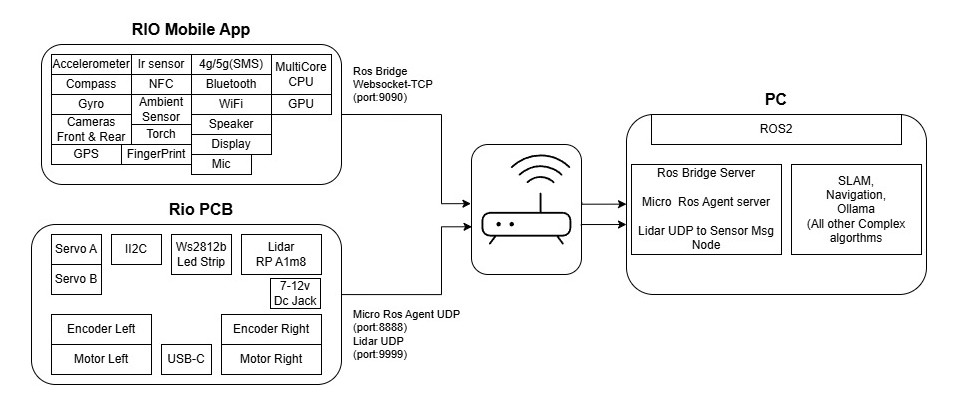

<p align="center">
    
</p>
<div align="center">
    
    
    
    
    
    
    
    
    
    
</div>

<!-- Start of Selection -->
<h2 align="center">Welcome to the Project RIO!</h2>
<!-- End of Selection -->

<!-- Start of Selection -->


🤖 **RIO Revolution** - Transform your smartphone into a fully-featured ROS2 robot! Utilize a wide array of built-in mobile sensors, including the Accelerometer, Gyro, Compass, GPS, NFC, IR, Ambient Light, Fingerprint Scanner, Cameras, and Mic/Speaker, as ROS2 topics, services, and actions. With the integration of Lidar, we can enable autonomously navigating companion robots that express emotions through animated facial expressions, while also extending functionality with our custom hardware platform.

### 📱 Mobile Core Features

- 📡 15+ built-in sensors as ROS2 interfaces
- 👁️ Programmable facial expressions displayed on the screen, enabling the robot to engage in conversation using its microphone and speaker.
- 🔌 Unified mobile-to-robot communication

<div style="display: flex; flex-wrap: wrap; gap: 15px; justify-content: center; margin: 25px 0; max-width: 800px; margin-left: auto; margin-right: auto;">
    <div style="flex: 0 0 calc(50% - 15px); box-sizing: border-box;">
        
    </div>
    <div style="flex: 0 0 calc(50% - 15px); box-sizing: border-box;">
        
    </div>
    <div style="flex: 0 0 calc(50% - 15px); box-sizing: border-box;">
        
    </div>
    <div style="flex: 0 0 calc(50% - 15px); box-sizing: border-box;">
        
    </div>
    <div style="flex: 0 0 calc(50% - 15px); box-sizing: border-box;">
        
    </div>
    <div style="flex: 0 0 calc(50% - 15px); box-sizing: border-box;">
        
    </div>
</div>

### 🛠️ Hardware Expansion

- ⚡ RIO Control Board based on ESP32 (MicroROS compatible)
- 🔌 Easy-to-use plug-and-play ports:
  - 2x Motors (controlled via a 2-channel L293D driver)
  - 2x Quadrature Encoders
  - 2x Servos with a 5V 2A power output
  - 1x I2C port with 5V power supply
  - 1x WS2812B LED Strip
  - 1x Lidar sensor
  - 1x 7-12V DC power jack
  - Type-C programming connector
- 📡 Seamless integration with RPLIDAR A1M8 for enhanced mapping capabilities

<div style="text-align: center; margin: 20px;">
    
</div>

## 🏛️ Rio Architecture

<div style="text-align: center; margin: 20px;">
    
</div>

## ⚙️ Requirements

### Hardware Requirements

- [Assembled RIO Robot with Control PCB](https://github.com/botforge-robotics/rio_hardware) (BOM, assembly and firmware flashing.)
- Android Smartphone

### Software Requirements

- [ROS 2 Iron Irwini](https://docs.ros.org/en/iron/Installation.html) (Recommended)
- [Ollama Installation](https://ollama.ai/download) (Local LLM Execution)
- [RIO Companion App](https://play.google.com/store/apps/details?id=com.botforge.rio) (Coming Soon on Play Store)

## 🚀 Getting Started

### 1. Environment Setup

```bash
# 1.1 Source ROS installation
source /opt/ros/$ROS_DISTRO/setup.bash

# 1.2 Set up Micro-ROS workspace
mkdir -p ~/uros_ws/src
cd ~/uros_ws/src
git clone -b $ROS_DISTRO https://github.com/micro-ROS/micro_ros_setup.git
cd ~/uros_ws
rosdep update && rosdep install --from-paths src --ignore-src -y
colcon build
source install/setup.bash

# 1.3 Building Micro ROS Agent
ros2 run micro_ros_setup create_agent_ws.sh
ros2 run micro_ros_setup build_agent.sh
source install/local_setup.bash

# 1.4 Set up RIO workspace
mkdir -p ~/rio_ws/src
cd ~/rio_ws/src
git clone https://github.com/botforge-robotics/rio_ros2.git
cd ~/rio_ws
rosdep install --from-paths src --ignore-src -r -y
colcon build
source install/setup.bash
```

### 2. Terminal Configuration

Add these to your `~/.bashrc` for automatic sourcing in new terminals:

```bash
# 2.1 Add ROS source
echo "source /opt/ros/$ROS_DISTRO/setup.bash" >> ~/.bashrc

# 2.2 Add Micro-ROS workspace source
echo "source ~/uros_ws/install/setup.bash" >> ~/.bashrc

# 2.3 Add RIO workspace source
echo "source ~/rio_ws/install/setup.bash" >> ~/.bashrc
```

> **Important**: For existing terminals, manually run these commands or restart your shell:
>
> ```bash
> # 2.4 Manual sourcing for existing terminals
> source /opt/ros/$ROS_DISTRO/setup.bash
> source ~/uros_ws/install/setup.bash
> source ~/rio_ws/install/setup.bash
> ```

### 3. Real Robot Launch

```bash
# 4.1 Launch real robot nodes
ros2 launch rio_bringup rio_real_robot.launch.py \
  use_sim_time:=false \
  agent_port:=8888
```

**Real Robot Parameters**:
| Parameter | Description | Default Value | Options |
|-----------|-------------|---------------|---------|
| `use_sim_time` | Use simulation clock (must be false for real hardware) | `false` | `true`/`false` |
| `agent_port` | Micro-ROS agent UDP port | `8888` | Any available port number |

### 4. Simulation Launch

```bash
# 3.1 Launch Gazebo simulation
ros2 launch rio_simulation gazebo.launch.py \
  world:=house.world \
  use_sim_time:=true
```

**Simulation Parameters**:
| Parameter | Description | Default Value | Options |
|-----------|-------------|---------------|---------|
| `world` | Gazebo world file | `empty.world` | `house.world`, `warehouse.world` |
| `use_sim_time` | Use simulation clock | `true` | `true`/`false` |

### 5. Mapping & Navigation

#### 5.1 Create Map

```bash
# 5.1.1 Launch SLAM mapping
ros2 launch rio_mapping mapping.launch.py \
  use_sim_time:=false
```
> **Note**: Refer mapping params in _rio_mapping/params/mapping_config.yaml_ for any modifications.

#### 5.2 Teleoperation Methods

##### 5.2.1 Joystick Teleop

```bash
# 5.2.1.1 Launch joystick teleop
ros2 launch rio_teleop teleop_joy.launch.py
```
> **Note**: Refer joystick params in _rio_teleop/params/joystick.yaml_ for any modifications.

##### 5.2.2 RQT Robot Steering GUI

```bash
# 5.2.2.1 Install RQT if not already installed
sudo apt install ros-$ROS_DISTRO-rqt-robot-steering

# 5.2.2.2 Launch RQT Robot Steering
ros2 run rqt_robot_steering rqt_robot_steering
```

> **Tip**: Ensure your robot's teleop topic is correctly configured.
> Typical topics include:
>
> - `/cmd_vel` for drive robot

#### 5.3 Save Map

```bash
# 5.3.1 Save created map
ros2 run nav2_map_server map_saver_cli -f <map_file_name>
```

This saves map files inside `rio_mapping/maps/` folder.

#### 5.4 Autonomous Navigation

```bash
# 5.4.1 Launch navigation
ros2 launch rio_navigation navigation.launch.py \
  map:=house.yaml \
  params_file:=nav2_real_params.yaml \
  use_sim_time:=false
```

**Navigation Parameters**:
| Parameter | Description | Default Value | Options |
|-----------|-------------|---------------|---------|
| `map` | Map file for navigation | `house.yaml` | YAML map file name |
| `params_file` | Navigation parameters | `nav2_real_params.yaml` | YAML config file name, Available: `nav2_real_params.yaml`/ `nav2_sim_params.yaml` |
| `use_sim_time` | Use simulation clock | `false` | `true`/`false` |

### Visualization Tools

### 6. Visualization Tools

```bash
# 6.1 Launch RViz
ros2 launch rio_simulation rviz.launch.py \
  rviz_config:=default.rviz
```

**Visualization Parameters**:
| Parameter | Description | Default Value | Options |
|-----------|-------------|---------------|---------|
| `rviz_config` | RViz config file | `default.rviz` | Any .rviz config |

## 📡 RIO Interfaces

### Topics

#### Publishers (Mobile App → ROS2)
| Topic | Type | Description |
|-------|------|-------------|
| `/battery` | `sensor_msgs/BatteryState` | Battery status information |
| `/expression` | `std_msgs/String` | Current facial expression |
| `/gps` | `sensor_msgs/NavSatFix` | GPS location data |
| `/imu/data` | `sensor_msgs/Imu` | Raw IMU data (accelerometer, gyroscope) |
| `/imu/mag` | `sensor_msgs/MagneticField` | Magnetometer readings |
| `/imu/orientation` | `geometry_msgs/Quaternion` | Device orientation in quaternions |
| `/imu/absolute_orientation` | `geometry_msgs/Quaternion` | Absolute orientation with magnetic reference |
| `/imu/heading` | `std_msgs/Float32` | Heading angle in degrees |
| `/imu/linear_acceleration` | `geometry_msgs/Vector3` | Linear acceleration without gravity |
| `/illuminance` | `sensor_msgs/Illuminance` | Ambient light sensor readings |
| `/speech_recognition/result` | `std_msgs/String` | Recognized speech text |
| `/speech_recognition/status` | `std_msgs/String` | Speech Recognition system status ("listening", "done") |
| `/speech_recognition/hotword_detected` | `std_msgs/Empty` | Wake word detection |

#### Publishers (PCB → ROS2)
| Topic | Type | Description |
|-------|------|-------------|
| `/scan` | `sensor_msgs/LaserScan` | LIDAR scan data |
| `/sonar` | `sensor_msgs/Range` | Ultrasonic sensor range data |
| `/odom` | `nav_msgs/Odometry` | Robot odometry data |

#### Subscribers (Mobile App ← ROS2)
| Topic | Type | Description |
|-------|------|-------------|
| `/torch` | `std_msgs/Bool` | Flashlight control |

#### Subscribers (PCB ← ROS2)
| Topic | Type | Description |
|-------|------|-------------|
| `/cmd_vel` | `geometry_msgs/Twist` | Robot velocity commands |
| `/servoA` | `std_msgs/Int16` | Servo A position control (0-180°) |
| `/servoB` | `std_msgs/Int16` | Servo B position control (0-180°) |
| `/left_led` | `std_msgs/ColorRGBA` | Left LED RGBA control |
| `/right_led` | `std_msgs/ColorRGBA` | Right LED RGBA control |

### Actions

#### Text-to-Speech (`/tts`)
- **Type**: `rio_interfaces/action/TTS`
- **Description**: Converts text to speech with facial expressions
- **Usage**:
  ```bash
  # Send goal
  ros2 action send_goal /tts rio_interfaces/action/TTS \
    "{text: 'Hello, how are you?', voice_output: true, start_expression: 'happy', end_expression: 'neutral', expression_sound: false}"
  ```

#### SMS Sending (`/sms`)
- **Type**: `rio_interfaces/action/Sms`
- **Description**: Send SMS messages using phone's cellular network
- **Usage**:
  ```bash
  # Send goal
  ros2 action send_goal /sms rio_interfaces/action/Sms \
    "{number: 1234567890, message: 'Hello from RIO!', sim_slot: 0}"
  ```

#### Authentication (`/auth`)
- **Type**: `rio_interfaces/action/Auth`
- **Description**: Authenticate using phone's biometric sensors
- **Usage**:
  ```bash
  # Send goal
  ros2 action send_goal /auth rio_interfaces/action/Auth \
    "{message: 'Please authenticate to continue'}"
  ```

### Services

#### Camera Control (`/enable_camera`)
- **Type**: `rio_interfaces/srv/Camera`
- **Description**: Control phone's front/back cameras
- **Usage**:
  ```bash
  # Enable front camera
  ros2 service call /enable_camera rio_interfaces/srv/Camera \
    "{direction: 0, status: true}"

  # Enable back camera
  ros2 service call /enable_camera rio_interfaces/srv/Camera \
    "{direction: 1, status: true}"

  # Disable camera
  ros2 service call /enable_camera rio_interfaces/srv/Camera \
    "{direction: 0, status: false}"
  ```
- **Parameters**:
  - `direction`: 0 (front) or 1 (back)
  - `status`: true (enable) or false (disable)

#### Expression Management
##### Set Expression (`/set_expression`)
- **Type**: `rio_interfaces/srv/Expression`
- **Description**: Set robot's facial expression
- **Available Expressions**:
  | Expression | Description |
  |------------|-------------|
  | `idle` | Default neutral state |
  | `listening` | Active listening mode |
  | `thinking` | Processing or computing |
  | `speaking` | Talking animation |
  | `curious` | Shows interest or curiosity |
  | `afraid` | Displays fear or concern |
  | `blush` | Embarrassed or shy |
  | `angry` | Shows frustration or anger |
  | `sad` | Displays sadness |
  | `happy` | Shows joy or pleasure |
  | `surprise` | Displays astonishment |
  | `sleep` | Power saving mode |
  | `wakeup` | Activation animation |
- **Usage**:
  ```bash
  # Set happy expression with sound
  ros2 service call /set_expression rio_interfaces/srv/Expression \
    "{expression: 'happy', expression_sound: true}"

  # Set neutral expression without sound
  ros2 service call /set_expression rio_interfaces/srv/Expression \
    "{expression: 'neutral', expression_sound: false}"

  # Set thinking expression with sound
  ros2 service call /set_expression rio_interfaces/srv/Expression \
    "{expression: 'thinking', expression_sound: true}"
  ```

##### Get Expression Status (`/expression_status`)
- **Type**: `rio_interfaces/srv/GetExpression`
- **Description**: Get current facial expression
- **Usage**:
  ```bash
  # Get current expression
  ros2 service call /expression_status rio_interfaces/srv/GetExpression "{}"
  ```

> **Note**: All examples use command-line interface. For programmatic usage, refer to the [rio_interfaces](https://github.com/botforge-robotics/rio_interfaces) package documentation.

